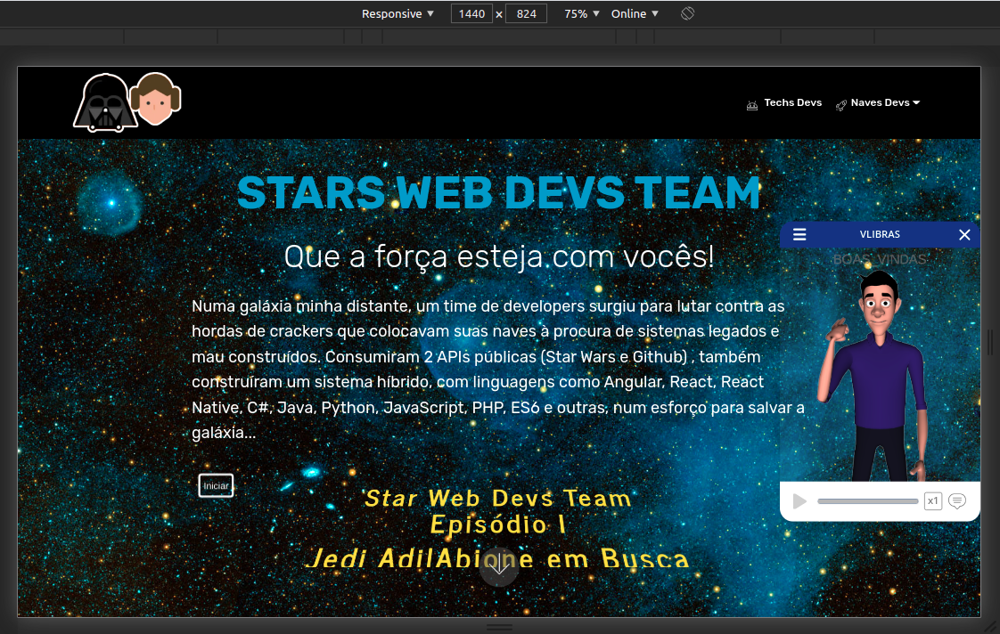
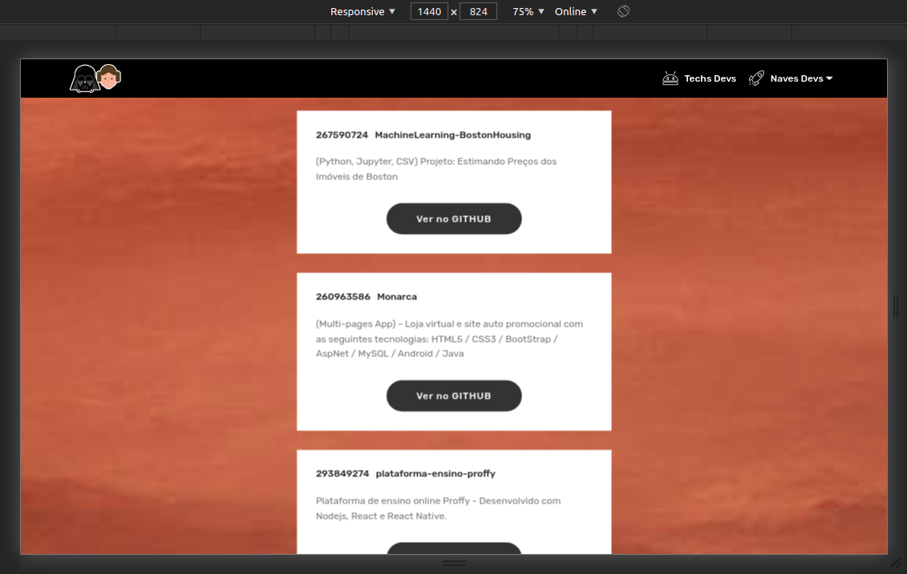
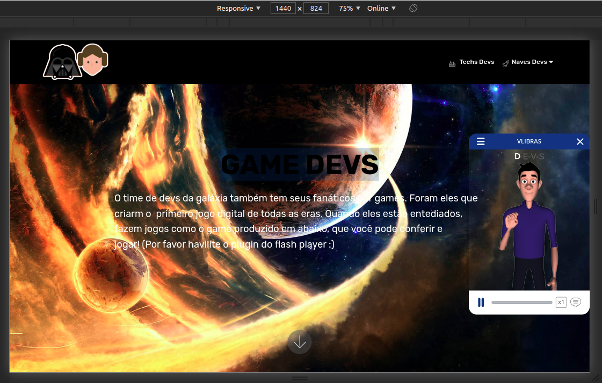
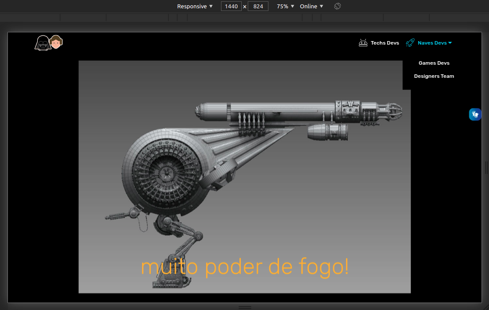
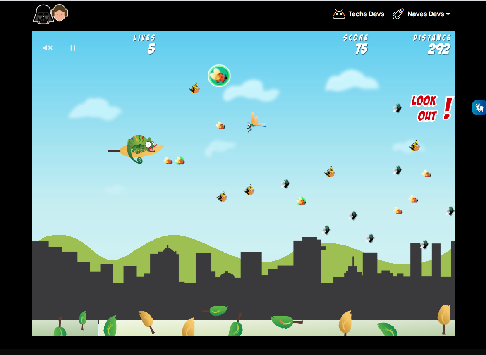
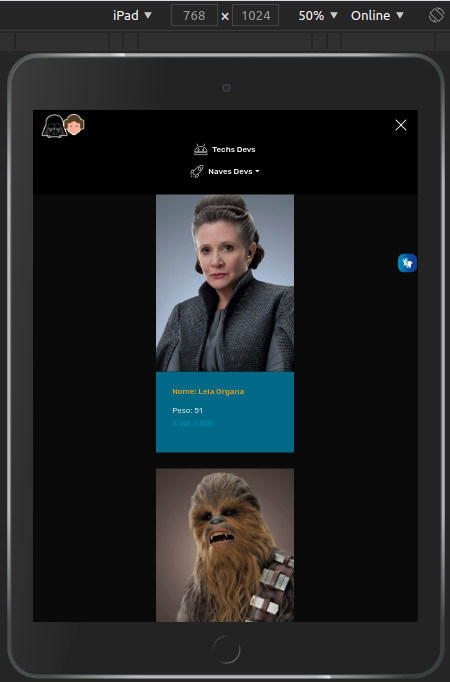
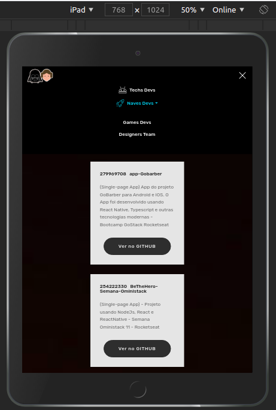
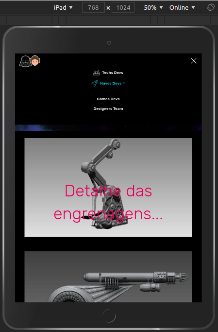
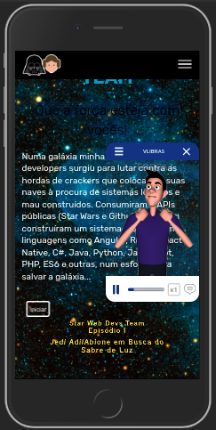
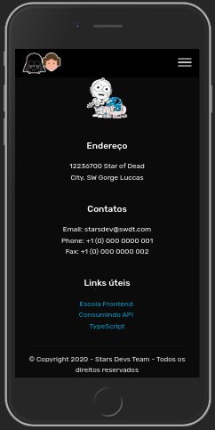

<h1 align="center"></h1>

<h4 align="center"> 
	:heavy_check_mark:  Desafio do programa do 1º Programa Catalisa da ZUP - Consumos de APIs Públicas - StarWars API e GitHub API :heavy_check_mark:
</h4>

## 🔖 Algumas Interfaces no Desktop - Ipad - Iphone
<p align="center" vetical-aling="top">
 &nbsp;&nbsp;&nbsp;&nbsp;&nbsp;&nbsp;
 &nbsp;&nbsp;&nbsp;&nbsp;&nbsp;&nbsp;
</p>

<p align="center" vetical-aling="top"> 
 &nbsp;&nbsp;&nbsp;&nbsp;&nbsp;&nbsp;
   &nbsp;&nbsp;&nbsp;&nbsp;&nbsp;&nbsp; 
</p>

<p align="center" vetical-aling="top"> 
 &nbsp;&nbsp;&nbsp;&nbsp;&nbsp;&nbsp;   
</p> 

<p align="center" vetical-aling="top"> 
 &nbsp;&nbsp;&nbsp;&nbsp;&nbsp;&nbsp;	
 &nbsp;&nbsp;&nbsp;&nbsp;&nbsp;&nbsp;
 &nbsp;&nbsp;&nbsp;&nbsp;&nbsp;&nbsp; 
</p>

<p align="center" vetical-aling="top"> 
 &nbsp;&nbsp;&nbsp;&nbsp;&nbsp;&nbsp;	
 &nbsp;&nbsp;&nbsp;&nbsp;&nbsp;&nbsp;
</p>


## 💻 Projeto
<p>
    Este pequeno projeto foi desenvolvido em 3 dias usnado Angular2 (v10), linguagem com a qual nunca havia trabalhado. Envolve conceitos de rotas, componentes, services, lazy landing, consumo de duas APIs públicas, sendo que a Starwars API eu mesmo publiquei em um CDN pois a que encontrei não estava ativa em um, portanto decidi publicar a minha versão. Maldito CORS, perdi meio dia com ele, sem contorná-lo o servidor restringia acesso a API. Também fiz consumo da API do Github, porisso tem uma página do site dedicada a mostrar meus projetos publicados no github. Também há integração com o Bootstrap ( oh, a sangria de css nos componentes!) sendo o site totalmente responsivo, e como o Catalisa é um programa para PCDs, foi incluso o VLibras para dar suporte à acessibilidade. </p>
<ul>	
<li> Angular2 pela primeira vez!</li>
<li> Maldito Cors e sangria de CSS nos componentes</li>
<li> O VLdibras traduziu "Que a força esteja com vocês"</li>
<li> Bootstrap parece não ter sido feito para Angular</li>
<li> Publiquei um velho game para o avaliador se desestressar!</li>
<li> O logotipo, o R2D2 e o C3PO do rodapé eu mesmo vetorizei. :)</li>
</ul>

<p align="center">
  <a href="#Tecnologias">Tecnologias</a>&nbsp;&nbsp;&nbsp;|&nbsp;&nbsp;&nbsp;
    <a href="#Metodologias">Metodologias</a>&nbsp;&nbsp;&nbsp;|&nbsp;&nbsp;&nbsp;
  <a href="#information_source-como-usar">Como Usar</a>&nbsp;&nbsp;&nbsp;|&nbsp;&nbsp;&nbsp;
  <a href="#memo-licença">Licença</a>
</p>

## :Tecnologias

Este projeto foi desenvolvido com  as seguintes tecnologias:

- [Angular](https://angular.io/)
- [JavaScript](https://developer.mozilla.org/pt-BR/docs/Web/JavaScript)
- [HTML5](https://devdocs.io/html/) 
- [CSS3](https://devdocs.io/css/)
- [Json](https://www.json.org/json-en.html)

## :Softwares

Os seguintes softwares foram utilizados neste projeto:

- [VsCode](https://code.visualstudio.com/download)
- [Adobe](https://www.adobe.com/pt/creativecloud.html)
- [Figma](https://www.figma.com/)


## :Metodologias

Artigos que estou a publicar no Medium que explica resumidamente cada metodologia utilizada :

- [Design UX](#) 
- [Design Sprint](#)
- [Design UI](#)
- [Scrum](#)

## :information_source: Como Usar

Para clonar a aplicação, você necessitará do [Git](https://git-scm.com), [NPM][npm] + [Angular CLI][angular] instalados em seu computador.

From your command line:

### Install API
```bash
# Clone this repository
$ git clone https://github.com/ApoOliveira18/cataliza-zup.git
# Go into the repository
$ cd cataliza-zup/

# Install dependencies for directories
$npm install

```

## :memo: Licença
Este projeto está sob licença MIT. Veja a [LICENSE] para mais informações.

---

Feito com ♥ && 🎧 && 😊 || 😥 
 por Adilson Oliveira :wave: [Get in touch!] www.linkedin.com/in/adilson-p-oliveira
 
[nodejs]: https://nodejs.org
[angular]: https://angular.io
[npm]: https://https://www.npmjs.com

